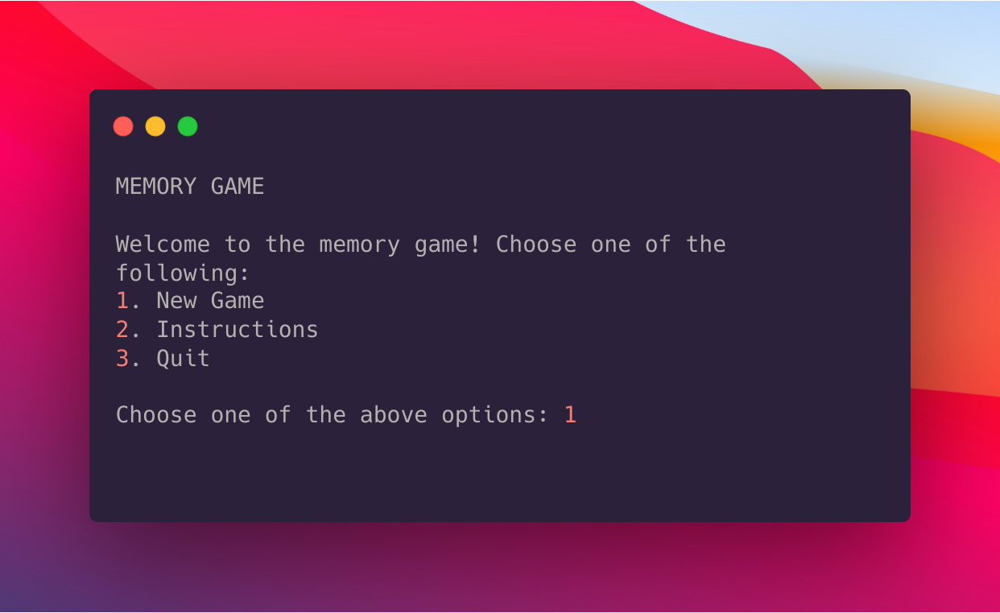

# About the game 
> - It is a basic game for building memory in which you have to choose a topic from the given ones.
>- You will be asked to name one item from the group of items you have chosen.
>- (Eg: You chose countries as your topic. "India" or "America" are valid answers).
>- After that, it,s the computer's turn. The computer will repeat the item that you mentioned and then add a new item from the same genre.
>- After that, it,s your turn. you have to memorize all items that have been added so far and enter them.
>- This cycle keeps repeating and the list to be memorized keeps growing in size, either till the list for the given genre has been exhausted, in which case you win, or you make a mistake in recalling the sequence of items, in which case the computer wins.
>- ⚠️Be careful while entering the list as incorrect spelling of even the right answers will still count as wrong answers.
>- You can get all this above information by choosing 2nd option from the welcome screen of the game.

# Features:-
- On a plus note input is not case sensitive.
>## python modules used
- [Random module](https://docs.python.org/3/library/random.html) 
- [Csv module](https://docs.python.org/3/library/csv.html)
- [Click module](https://docs.python.org/3/library/csv.html)

# Requirements:-
>- ## Python 3.+(personally i used Python 3.8.5).
- Check your Python version by typing ```python --version``` in terminal/cmd prompt. If version is python 3.x you can continue. If version is python 2.x, try: ```python3 --version```. 

# Instruction to play the game

 ## Cloning this repository
```
$ git clone https://github.com/kumarharsh2396/Text-based-game.git
```
## Going into the reposistory
```
$ cd Text-based-game
```
## Running the game
```
$ python3 game.py
```

# Contributing
 I would love to expand this game and add more genres. To contribute a new genre, follow these steps:

1. Find a common genere that would be suitable for this game.

2. Compile a .csv file of all the items from that genre with each item on a new line, and no space after the name of the item on the same line. Please try to make the list as exhaustive as possible, because the game validates the user's input based on whether or not given input is an item in the list. Also, the .csv should have atleast 50 items. Save the .csv in the CSVs directory with an appropriate name.

3. Open the game.py file and go into the ```chooseGenre()``` funtion. Here, add ```print("n. genereName")``` just above the comment ```# Add more choices here```. Replace ```n``` with the serial number and ```genereName``` with the name of the genere you're adding.

4. Just above the comment ```# Add more elif statements here``` add the following two lines:

```
elif choice == "n"
	return "csvFileName"
```	

>Replace ```n``` with the same serial number you gave above and ```csvFileName``` with the exact name that the .csv file was saved with. 

>Now run ```python3 game.py``` and in the genre list, you should see your addition show up.
